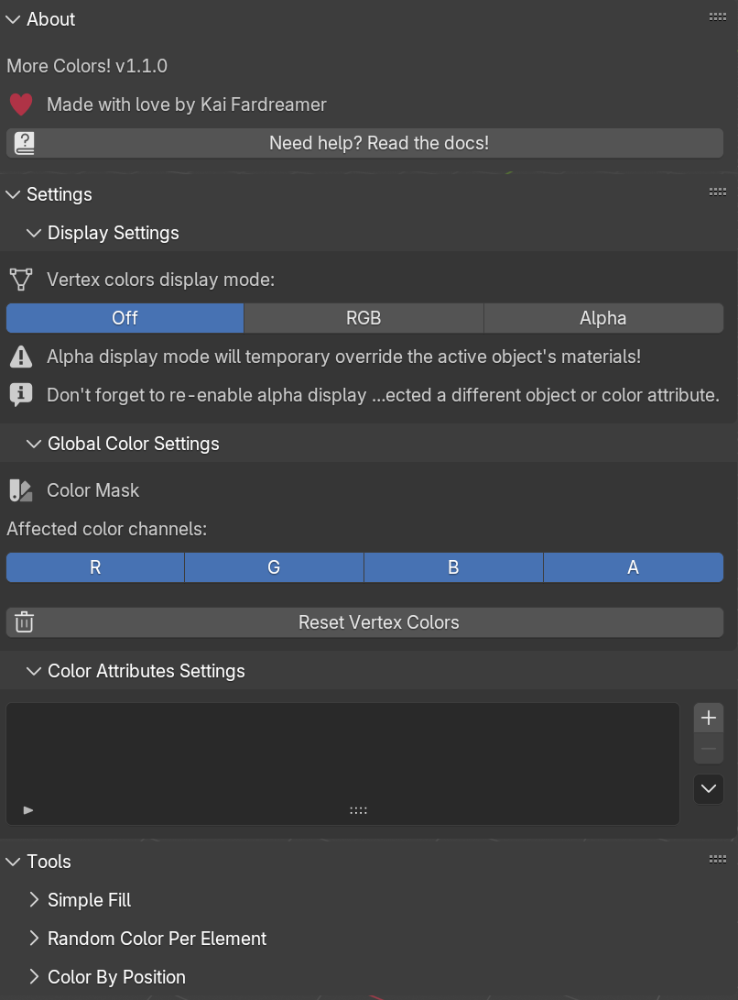
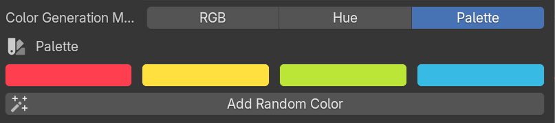
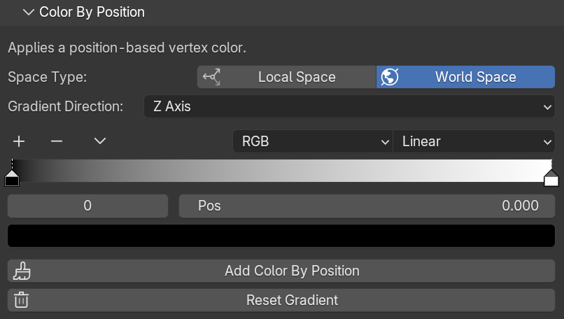

# 🖌️ More Colors!

A simple Blender add-on that makes working with vertex colors easier.

## ✨ Features

- 👁️ **Preview vertex colors (including alpha!)** from object and edit modes
- 🖌️ Various tools, including **simple selection fill**, **random color generator**, and a **gradient generator**
- 🎨 Supports editing different **color attributes**
- 🎭 **RGBA color masking**, modify only the channels you need

## ✅ Prerequisites

- [Blender 4.2 or higher](https://www.blender.org/download/)

## 🔧 Installation

There are two ways to install the add-on: **via Blender's extensions** or **manually**. Let's take a look at each option.

### Manual Installation

1. Download the latest version of the package
2. Inside Blender go to **Edit** -> **Preferences** -> **Get Extensions**
3. Click on the down arrow at the top right corner

   

4. Press **"Install from Disk..."**
5. Selected the **downloaded package**
6. Enjoy ✨

### Installation Via Blender's Extensions

1. Inside Blender go to **Edit** -> **Preferences** -> **Get Extensions**
2. In the search box type **"More Colors!"**
3. Click **"Install"**
4. You're awesome ✨

## 🚀 Getting Started

After installing the add-on, you can see it on the side panel (press **N** to open it). It should look something like this: 

As you can see, it consists of several main sections, including **About**, **Settings** and **Tools** sections.

### About Section

Contains general info about the plugin such as add-on _name_ and _version_, as well as a _link to this documentation_.

### Settings Section

Contains various settings, including **display settings** and **global color settings**.

#### Display Settings

With display settings, you can choose, how vertex colors will be displayed. You can view their **RGB** or **Alpha** channels. **Make sure it's not disabled before using any of the tools!**

#### Global Color Settings

The add-on has two settings here: a **color mask** and a **reset colors button**.

With the color mask, you can restrict, _which RGBA channels are affected by add-on tools_. **Every channel is on by default**, which means colors are applied as usual.
But imagine you left only the red channel on. In this case, **only the red channel values will be modified**, and values on other channels **will not be affected**.
Why do we need this? Well, you can use different color channels to store different information that will be used later _(for instance in shaders)_.
As an example, your red channel might be a position gradient, your blue channel might be some kind of a mask, and so on.

#### Reset Color Button

A reset colors button just **sets all vertex colors to white**.

#### Color Attributes Settings
In this panel, you can select, **which color attribute will be affected by the tool**. If your object has no color attributes, the plugin **will create one automatically** for you!

## 🪛 Tools

Contains all the tools the add-on has to offer. At the moment it has a **Simple Fill**, a **Random Color Per Element**, and a **Color By Position** tool.

### Simple Fill Tool

It applies a **selected color** to the **selected object(s) or selected parts of the mesh** _(points, edges, or faces)_.
Also has four **preset colors**, you can _assign_ them as your main color with a **select button**, or _immediately apply_ them to the mesh with a **quick apply button**.

### Random Color Per Element Tool

Applies a **random color** to the _selected object(s)_. **Doesn`t support applying colors to parts of the mesh!**

#### Generate Per Element

There are several elements per which random colors will be generated:

- **Points**
- **Vertices**
- **Faces**
- **Islands**

#### Color Generation Algorithm

Also, you can choose, how colors will be generated. There are three modes: **RGB**, **Hue**, and **Palette**.

**RGB random colors** are colors, where each component _(red, green, and blue values)_ are independently generated numbers in a range from zero to one.

**Hue random colors** are generated by creating an HSV _(hue, saturation, value)_ color representation first, randomizing the hue value, and then converting it back to RGB space. It produces more distinct results, which might be useful for ID maps for example.

**Palette random colors** assigns randomly selected colors from a 4-color palette that you define. It might be useful if you want to use specific colors for the randomization.

### Color By Position Tool

Generates a **gradient**, based on **vertex position** along a selected direction. You can choose between generating a gradient in the **object's local space** _(rotation affects the direction of the gradient)_ or in **world space** _(object rotation doesn't affect the gradient direction)_.

## ⚠️ Known Issues
### Alpha vertex display mode
Since Blender doesn't have a built-in feature to display the alpha channel of vertex colors, I had to use a special material for that. When you enable alpha display mode, this material temporarily overrides all active object materials. If you have different materials assigned to various parts of your geometry, alpha display mode will reassign them, so be careful with that.

Also, if you change an active object or color attribute, the material will not update automatically and you have to manually re-enable alpha display mode to see the updates.

### Color attribute domains
Color attributes might have two domains: vertex and face corner. The vertex domain stores colors per point (for instance a cube has 8 points), while the face corner domain stores colors per vertex (a cube has 24 vertices, 3 per point). It sounds confusing, but the thing is a face corner domain gives you much more control over vertex colors, so I recommend using only it. 

Still, the plugin supports vertex domain, but some tools will be limited, for instance, you will lose the ability to choose the element random colors will be applied.

## 📃 License

Licensed under GNU General Public License, Version 3.0, [LICENSE](LICENSE) or https://www.gnu.org/licenses/gpl-3.0.en.html

## ❤️ Gratitude

Some ideas are inspired by [Ethan Simon-Law](https://github.com/oRazeD)`s [Vertex Color Plus](https://github.com/oRazeD/VertexColorsPlus/tree/stable) addon, check it out as well!
