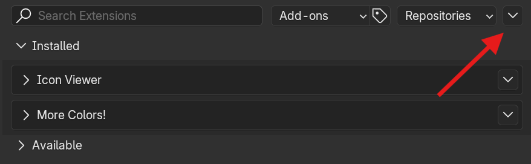

# 🖌️ More Colors!

A simple Blender add-on that makes working with vertex colors easier.

## ✨ Features

- 👁️ **Preview vertex colors** from object and edit modes
- 🖌️ Various tools, including **simple selection fill**, **random color generator**, and a **gradient generator**
- 🎭 **RGBA color masking**, modify only the channels you need

## ✅ Prerequisites

- [Blender 4.2 or higher](https://www.blender.org/download/)

## 🔧 Installation

There are two ways to install the add-on: **via Blender's extensions** or **manually**. Let's take a look at each option.

### Manual Installation

1. Download the latest version of the package
2. Inside Blender go to **Edit** -> **Preferences** -> **Get Extensions**
3. Click on the down arrow at the top right corner

   
   
5. Press **"Install from Disk..."**
6. Selected the **downloaded package**
7. Enjoy ✨

### Installation Via Blender's Extensions

🚧 The add-on is still under review, so at the moment it is not publicly visible as Blender extension. You can speed up the reviewing process by going to https://extensions.blender.org/approval-queue/more-colors/

1. Inside Blender go to **Edit** -> **Preferences** -> **Get Extensions**
2. In the search box type **"More Colors!"**
3. Click **"Install"**
4. You're awesome ✨

## 🚀 Getting Started

After installing the add-on, you can see it on the side panel (press **N** to open it). It should look something like this: 

As you can see, it consists of several main sections, including **About**, **Settings** and **Tools** sections.

### About Section

Contains general info about the plugin such as add-on _name_ and _version_, as well as a _link to this documentation_.

### Settings Section

Contains various settings, including **display settings** and **global color settings**.

#### Display Settings

With display settings, you can control _vertex color visibility_. **Make sure it's on before using any of the tools!**

#### Global Color Settings

The add-on has two settings here: a **color mask** and a **reset colors button**.

With the color mask, you can restrict, _which RGBA channels are affected by add-on tools_. **Every channel is on by default**, which means colors are applied as usual.
But imagine you left only the red channel on. In this case, **only the red channel values will be modified**, and values on other channels **will not be affected**.
Why do we need this? Well, you can use different color channels to store different information that will be used later _(for instance in shaders)_.
As an example, your red channel might be a position gradient, your blue channel might be some kind of a mask, and so on.

#### Reset Color Button

A reset colors button just **sets all vertex colors to black**.

## 🪛 Tools

Contains all the tools the add-on has to offer. At the moment it has a **Simple Fill**, a **Random Color Per Element**, and a **Color By Position** tool.

### Simple Fill Tool

It applies a **selected color** to the **selected object(s) or selected parts of the mesh** _(points, edges, or faces)_.
Also has four **preset colors**, you can _assign_ them as your main color with a **select button**, or _immediately apply_ them to the mesh with a **quick apply button**.

### Random Color Per Element Tool

Applies a **random color** to the _selected object(s)_. **Doesn`t support applying colors to parts of the mesh!**

#### Generate Per Element

There are several elements per which random colors will be generated:

- **Points**
- **Vertices**
- **Faces**
- **Linked**

The difference between points and vertices is that _a point can share several vertices_, but _a vertex is the smallest unit and cannot be divided into something else_.

Oh, and about linked. Linked elements usually occur, when you **combine several meshes into one**, by using Join _(Ctrl + J)_ for example. Even though the result of Join is a single mesh, you still can **split it by vertex connectivity** and **apply different colors per linked piece**.
This might be useful when you have a complex object consisting of several independent parts and you want to quickly make an ID map for it.

#### Color Generation Algorithm

Also, you can choose, how colors will be generated. There are two modes: **RGB** and **Hue** random.

**RGB random colors** are colors, where each component _(red, green, and blue values)_ are independently generated numbers in a range from zero to one.

**Hue random colors** are generated by creating an HSV _(hue, saturation, value)_ color representation first, randomizing the hue value, and then converting it back to RGB space. It produces more distinct results, which might be useful for ID maps for example.

### Color By Position Tool

Generates a **linear gradient**, based on **vertex position** along a selected direction. You can choose between generating a gradient in the **object's local space** _(rotation affects the direction of the gradient)_ or in **world space** _(object rotation doesn't affect the gradient direction)_.

## 📃 License

Licensed under GNU General Public License, Version 3.0, [LICENSE](LICENSE) or https://www.gnu.org/licenses/gpl-3.0.en.html

## ❤️ Gratitude

Some ideas are inspired by [Ethan Simon-Law](https://github.com/oRazeD)`s [Vertex Color Plus](https://github.com/oRazeD/VertexColorsPlus/tree/stable) addon, check it out as well!
